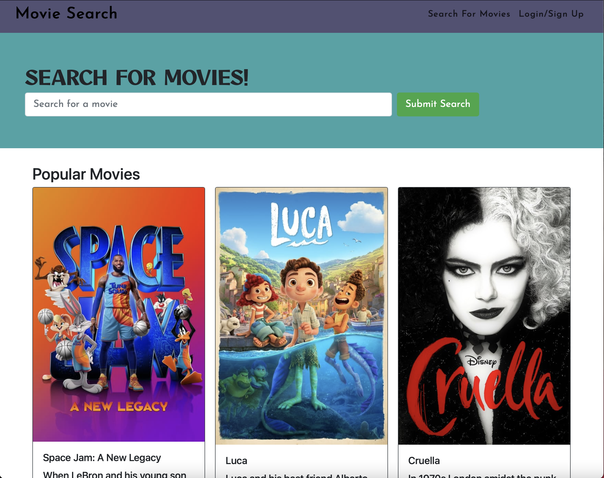
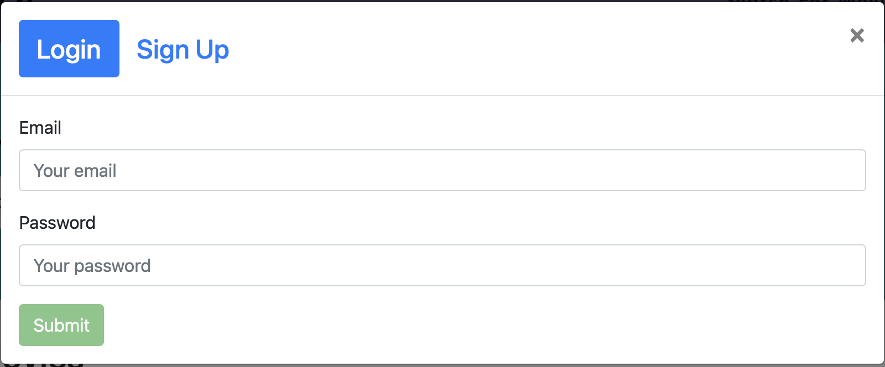

# Title
Interactive MERN SPA Project - Movie Search

---

## Table of Content
* [Summary](#summary)
* [Technology Used](#technologies)
* [Screenshots](#images)
* [Web Links](#links)
* [Collaborators](#collaborators)
* [License](#license)

---

## Summary
Projects have played a key role in our journey to becoming a full-stack web developer. As we apply for development jobs, our portfolios are absolutely vital to opening doors to opportunities. It’s important to feature high-quality deployed examples of our work—and we can use our finished projects for that very purpose.

This project will be our best opportunity to show employers our collaborative skills and coding abilities, especially in the context of a scalable, user-focused MERN app. Employers want to see what we can do, but they also want to see how we work with other developers. The more examples of deployed collaborative work we have in our portfolio, the more likely we are to get an interview and a job. That’s why one of the requirements for this project is that we add it to our portfolio.

Our group will use everything we’ve learned throughout this course to create a MERN stack single-page application that works with real-world data to solve a real-world challenge, with a focus on user demand. The user story and acceptance criteria will depend on the project that we create.

Have you ever had hard time looking for a desired movie? Yeah, we've all been there! You're welcome to check out our app and tell us what you think about it. This movie search will be the place where everyone will go to search for movies they haven't seen in a while. AND that's not all folks, you can also search up new movies, come on and give it a shot!! i know you want to!!

---

## Technology Used
HTML
CSS
Javascript
MySQL
Sequelize
Express.js
React

---

## Screenshots
MAIN PAGE

LOGIN

SEARCH
![image](./images/search.png
